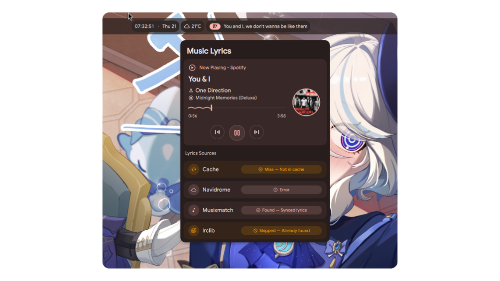

# Music Lyrics (Fork)


    
A DankMaterialShell widget plugin that displays synced music lyrics from multiple sources right on your panel.

## Features
* **Live Lyrics:** Shows real-time synced lyrics on the panel bar.
* **Smart Fetching:** Retrieves lyrics from your local cache, Navidrome, Musixmatch, or lrclib.net.
* **Media Player Management:** Click the widget to open a popout menu where you can view lyric fetch statuses and switch between active MPRIS media players. Also you can control the media player from the popout menu like play/pause, next/previous track, and volume control.
* **Application Filtering:** Block specific applications from displaying lyrics on the panel bar.

## Installation
1. Clone this repo directly to your DankMaterialShell plugins directory:
   ```bash
   git clone https://github.com/neroices/dms-plugin-musiclyrics ~/.config/DankMaterialShell/plugins/musiclyrics
   ```
2. Open DMS Settings → Plugins, click "Scan", and toggle "Music Lyrics" on.
3. Add the plugin to your DankBar widget list.
4. Restart your shell using the `dms restart` command.

## Configuration
Access the plugin settings via DMS to configure:
* **Local Cache:** Enabled by default. Saves downloaded lyrics to `~/.cache/musicLyrics` to speed up loading and reduce network requests.
* **Navidrome:** Enter your Server URL, Username, and Password to fetch lyrics from your own instance.
